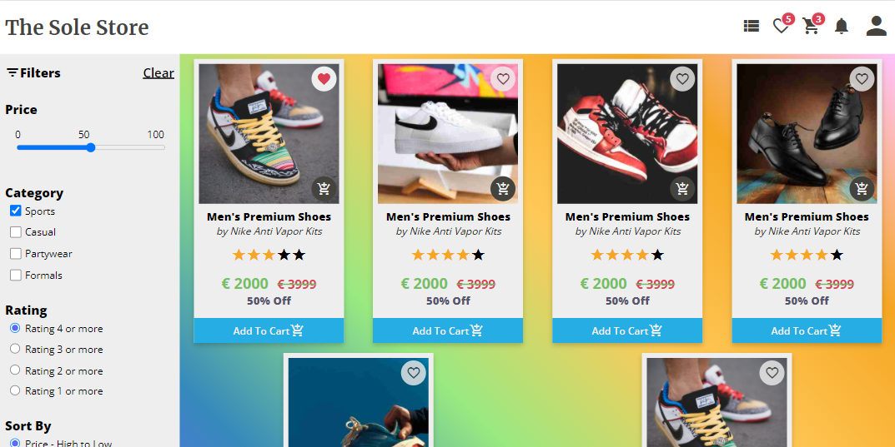
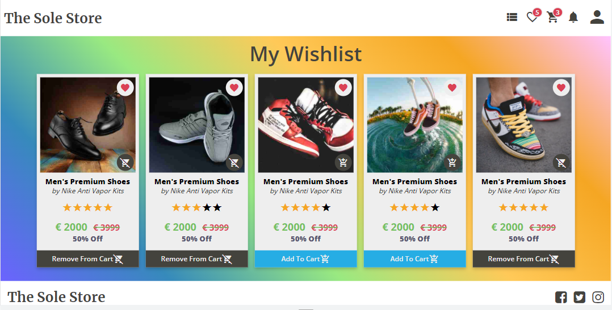
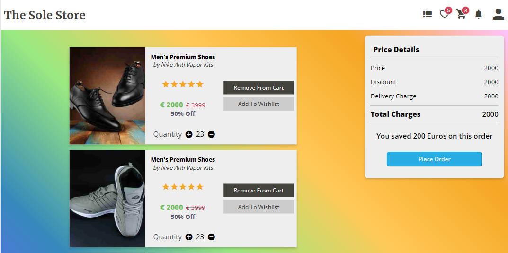
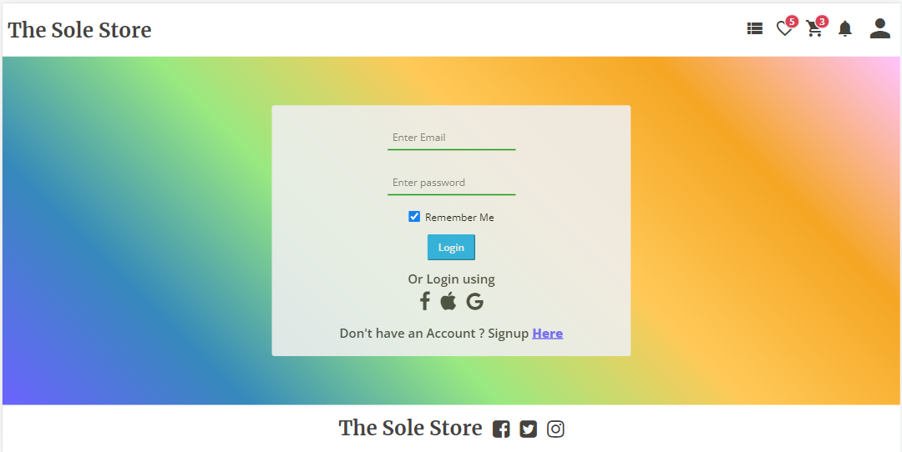
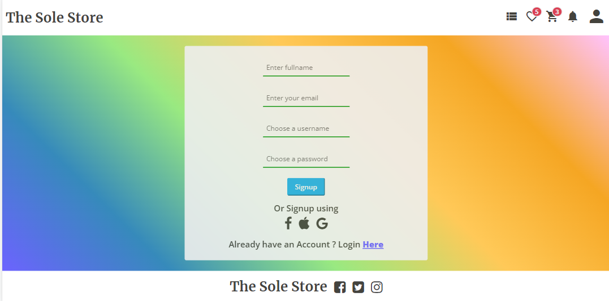
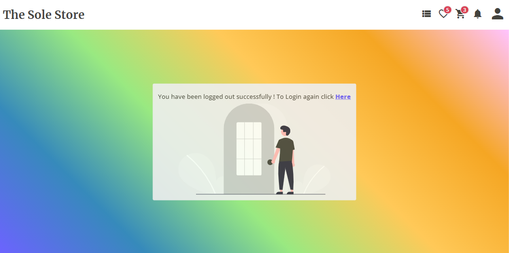

# TheSoleStore

### Disclaimer

The current application is still a WIP (work in progress) and hence all the functions may or may not work in the intended manner.     
At current stage only static (HTML, CSS & JS) templates have been developed for the respective components/pages.     

### The project is live at
#### Vercel : https://the-sole-store-git-development-hnh013.vercel.app/
#### Netlify: https://thesolestore.netlify.app/

## Contents

1. **[Project Title & description](#theSoleStore)**
2. **[Purpose of the project](#purpose-of-the-project)**
3. **[Technologies Used](#technologies-used)**
4. **[Motivations behind the project](#motivations-behind-the-project)**
5. **[Demo](#demo)**

## 1. The Sole Store
* The Sole Store is an e-commerce site focused on the sales of shoes of various kinds. It also shows latest articles and news regarding shoes, from launches to stories of different shoe making brands. 
* The application will offer its users to purchase from a wide variety of shoes available.   
* Users would be able to save their favorite items in wishlist, and add them to cart before buying.
* Users will be able to create account , login and logout from the application via an authentication system.

At this moment, current list of components/pages that are present in the application are :

1. Home Page [Link](https://thesolestore.netlify.app/index.html)
2. Products Page [Link](https://thesolestore.netlify.app/components/products.html)
3. Wishlist Page [Link](https://thesolestore.netlify.app/components/wishlist.html)
4. Cart Page [Link](https://thesolestore.netlify.app/components/cart.html)
5. Login Page [Link](https://thesolestore.netlify.app/components/login.html)
5. Signup Page [Link](https://thesolestore.netlify.app/components/signup.html)
5. Logout Page [Link](https://thesolestore.netlify.app/components/logout.html)

## 2. Purpose of the project
* The main aim of the project is to create a user-friendly, easily to navigate e-commerce website for the users where they can buys shoes of various kinds.
* the user should be able to add items and remove to his/her wishlist.
* The user should be able to add or remove items form his/her cat , increas or decrease the quantity before checkout.
* The user should be able to view the articles listed on the website.  

## 3. Technologies Used
* At the current stage of development, HTML , CSS and vanilla JS have been used in the project.

## 4. Motivations behind the project
* This project was built as part of my learning of HTML and CSS in neogcamp 2022.
* The projects was created to create an e-commerce application fully dedicated to the niche of everything about shoes, with not only limited to selling but also as a media site covering all the latest news and information about different shoe related news all over the world.

## 5. Demo

### The project is live at
#### Vercel : https://the-sole-store-git-development-hnh013.vercel.app/
#### Netlify: https://thesolestore.netlify.app/

#### Home Page [Link](https://thesolestore.netlify.app/index.html)

#### Products Page [Link](https://thesolestore.netlify.app/components/products.html)

#### Wishlist Page [Link](https://thesolestore.netlify.app/components/wishlist.html)

#### Cart Page [Link](https://thesolestore.netlify.app/components/cart.html)

#### Login Page [Link](https://thesolestore.netlify.app/components/login.html)

#### Signup Page [Link](https://thesolestore.netlify.app/components/signup.html)

#### Logout Page [Link](https://thesolestore.netlify.app/components/logout.html)

[Back To Top](#top)
